# REPORT: HW01 – QA/QC Jobs · 20 Defects · Test a Physical Product

* **Course:** CS423 - CSC15003 - Software Testing (AI-augmented · 2026) [HW01-AI]
* **Student Name:** Phạm Vũ Ngọc Duy
* **Student ID:** 23127183
* **Class:** KTPM4
* **GitHub Repository:** [https://github.com/DuyPham111/HW01] 
* **Self-Assessed Grade:** 95/100 

---
## REQUIREMENT 1: QA/QC Job Market 2026+

### Job 01 — Senior QC (Automation Tester, QA QC) @ PNJ
* **Link:** https://itviec.com/viec-lam-it/senior-qc-automation-tester-qa-qc-pnj-5542
* **Ảnh ngày đăng:** 15 ngày trước 
    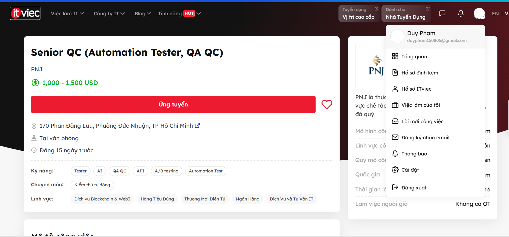
* **Địa điểm:** 170 Phan Đăng Lưu, P. Đức Nhuận, TP.HCM 
* **Yêu cầu AI:** Có 
* **Mô tả công việc:** Kiểm soát chất lượng cho cả sản phẩm truyền thống lẫn sản phẩm AI: lập kế hoạch kiểm thử, kiểm thử chức năng / UI-UX / hành vi AI, kiểm tra edge case – misuse – rủi ro nghiệp vụ, và đánh giá độ chính xác, độ tin cậy, tính công bằng của output AI. Mảng tự động hóa gồm: viết kịch bản test tự động, dùng công cụ kiểm thử AI (đánh giá LLM, dữ liệu tổng hợp), dựng CI/CD, dùng công cụ giả lập người dùng. Ngoài ra đảm bảo chất lượng dữ liệu huấn luyện AI (đầy đủ, cân bằng, tuân thủ bảo mật) và theo dõi hiệu suất mô hình theo thời gian.
* **Kỹ năng yêu cầu:** Tester, QA QC, Automation Test, API, A/B testing, AI; tối thiểu 4 năm kinh nghiệm Software Testing Automation có ứng dụng AI; tư duy phân tích rủi ro hệ thống + tư duy end-user; ưu tiên chứng chỉ ISTQB / Agile.
* **Mức lương:** 1,000 - 1,500 USD
* **AI Impact Analysis:** Đây là vị trí *sinh ra nhờ AI*: AI hỗ trợ phần lặp lại (sinh script tự động, tạo dữ liệu tổng hợp, đánh giá LLM), nhưng chính việc thẩm định độ tin cậy – công bằng của output AI và thiết kế các kịch bản misuse/edge case mà mô hình không lường trước vẫn cần phán đoán của con người. AI ở đây là *đối tượng được kiểm thử* chứ không thay thế được người kiểm thử.

### Job 02 — Automation QA Engineer (QA QC/Tester/Automation Test) @ Nakivo
* **Link:** https://itviec.com/viec-lam-it/automation-qa-engineer-qa-qc-tester-automation-test-nakivo-0115
* **Ảnh ngày đăng:** 14 ngày trước 
    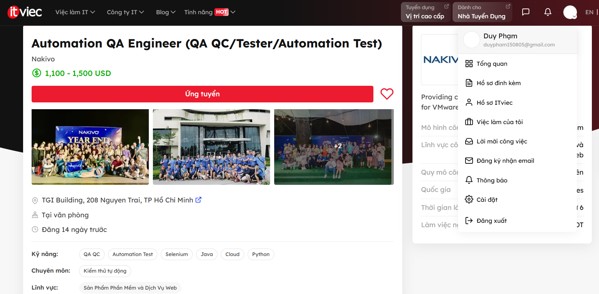
* **Địa điểm:** TGI Building, 208 Nguyen Trai, TP Hồ Chí Minh
* **Yêu cầu AI:** Có 
* **Mô tả công việc:** Phối hợp với đội ngũ phát triển phần mềm và QA để hiểu yêu cầu hệ thống, thiết kế và thực thi các kịch bản kiểm thử tự động bằng các công cụ tiêu chuẩn trong ngành. Công việc bao gồm phát hiện và báo cáo lỗi phần mềm, phân tích kết quả kiểm thử, xử lý sự cố và liên tục cải tiến quy trình Automation Testing. Ngoài ra, vị trí này còn yêu cầu thiết kế, xây dựng và quản lý các test case tự động bằng các công nghệ AI nhằm nâng cao hiệu quả kiểm thử và giảm khối lượng công việc thủ công.

* **Kỹ năng yêu cầu:** Tốt nghiệp ngành CNTT hoặc lĩnh vực liên quan; tối thiểu 3 năm kinh nghiệm; thành thạo ít nhất một ngôn ngữ lập trình (Java, Python hoặc C#); kinh nghiệm với Selenium, Appium hoặc các công cụ tương tự; hiểu biết về Git, SDLC và các phương pháp kiểm thử phần mềm. Ưu tiên ứng viên có kinh nghiệm với JUnit, TestNG, Selenium WebDriver, API Testing (Postman, RestAssured), Performance Testing, môi trường Cloud (AWS, VMware, Hyper-V) và các công cụ AI hỗ trợ kiểm thử như Copilot, Cursor, Perplexity.

* **Mức lương:** 1,100 - 1,500 USD

* **AI Impact Analysis:** Đây là ví dụ điển hình cho xu hướng QA hiện đại khi AI được tích hợp trực tiếp vào quy trình kiểm thử tự động. AI có thể hỗ trợ sinh test case, đề xuất script kiểm thử và tăng tốc quá trình bảo trì automation framework. Tuy nhiên, việc lựa chọn chiến lược kiểm thử, đánh giá mức độ rủi ro của hệ thống, xác minh tính đúng đắn của kết quả kiểm thử và quyết định phạm vi tự động hóa vẫn đòi hỏi kinh nghiệm và tư duy phân tích của QA Engineer. AI đóng vai trò trợ lý nâng cao năng suất thay vì thay thế hoàn toàn kỹ sư kiểm thử.

### Job 03 — QC Engineer (Tester/QA QC) for Web - Up to 1500$ @ Evolus/PlanV

* **Link:** https://itviec.com/viec-lam-it/qc-engineer-tester-qa-qc-for-web-up-to-1500-evolus-planv-5225

* **Ảnh ngày đăng:** 17 ngày trước 
    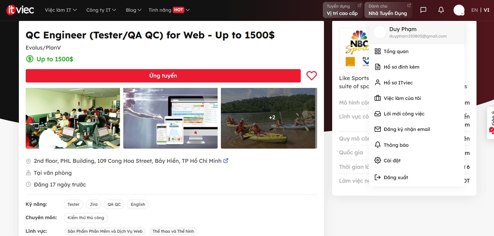

* **Địa điểm:** 2nd Floor, PHL Building, 109 Cộng Hòa, Tân Bình, TP.HCM

* **Yêu cầu AI:** Không 

* **Mô tả công việc:** Tham gia phát triển và kiểm thử các ứng dụng quản lý đội thể thao đang phục vụ hàng triệu người dùng tại Mỹ, Anh và châu Âu. Làm việc chặt chẽ với khách hàng tại Mỹ, đội UI/UX, lập trình viên và đội triển khai để đảm bảo chất lượng sản phẩm web. Chịu trách nhiệm phân tích yêu cầu, thiết kế và thực thi test case, phát hiện và báo cáo lỗi, đồng thời đảm bảo hệ thống hoạt động ổn định trên nhiều trình duyệt, nền tảng và thiết bị khác nhau.

* **Kỹ năng yêu cầu:** Tối thiểu 2 năm kinh nghiệm Manual Testing cho hệ thống web doanh nghiệp; thành thạo viết và thực thi test case, test script; hiểu rõ quy trình kiểm thử phần mềm và các loại kiểm thử; kinh nghiệm sử dụng Jira hoặc các công cụ quản lý lỗi tương tự; kỹ năng phân tích và tìm lỗi tốt; đọc viết tiếng Anh tốt. Ưu tiên ứng viên có kinh nghiệm kiểm thử cross-browser, cross-platform, responsive web, performance testing, security testing hoặc hệ thống thương mại điện tử.

* **Mức lương:** Up to 1500 USD/tháng.

* **AI Impact Analysis:** Đây là vị trí QA/QC truyền thống tập trung vào kiểm thử thủ công và phân tích chất lượng hệ thống web. Trong tương lai, AI có thể hỗ trợ tạo test case, sinh dữ liệu kiểm thử hoặc phân tích lỗi từ log hệ thống nhằm tăng năng suất làm việc. Tuy nhiên, việc hiểu yêu cầu nghiệp vụ, đánh giá trải nghiệm người dùng thực tế, xác định rủi ro hệ thống và đưa ra quyết định cuối cùng về chất lượng sản phẩm vẫn phụ thuộc nhiều vào kinh nghiệm và tư duy phản biện của kỹ sư QA. Vị trí này thể hiện nhóm công việc mà AI chủ yếu đóng vai trò hỗ trợ thay vì thay thế hoàn toàn con người.

### Job 04 — Automation Tester (QA QC) @ Mercatus

* **Link:** https://itviec.com/viec-lam-it/automation-tester-qa-qc-mercatus-4125

* **Ảnh ngày đăng:** 23 ngày trước
  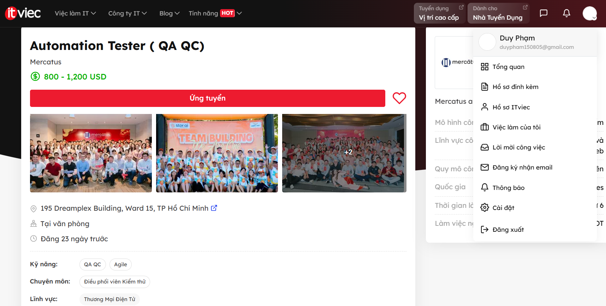

* **Địa điểm:** 195 Dreamplex Building, Ward 15, TP Hồ Chí Minh

* **Yêu cầu AI:** Không 

* **Mô tả công việc:** Chịu trách nhiệm xây dựng, phát triển và bảo trì hệ thống kiểm thử tự động cho các ứng dụng web và nền tảng thương mại điện tử. Phối hợp với Business Analyst, Developer và Product Owner để phân tích yêu cầu, thiết kế test case, thực thi kiểm thử chức năng và hồi quy, đồng thời đảm bảo chất lượng sản phẩm trong toàn bộ vòng đời phát triển phần mềm. Công việc cũng bao gồm theo dõi kết quả kiểm thử, báo cáo lỗi và đề xuất cải tiến quy trình QA nhằm nâng cao độ ổn định và hiệu quả phát triển sản phẩm.

* **Kỹ năng yêu cầu:** Có kinh nghiệm về Software Testing và Automation Testing; thành thạo các công cụ kiểm thử tự động như Selenium hoặc các framework tương đương; hiểu biết về SDLC, STLC và Agile/Scrum; có khả năng viết test case, test script và phân tích lỗi. Ưu tiên ứng viên có kinh nghiệm API Testing, CI/CD, Git và các ngôn ngữ lập trình phục vụ tự động hóa kiểm thử.

* **Mức lương:** 800 - 1,200 USD

* **AI Impact Analysis:** Đây là vị trí Automation Tester điển hình, trong đó AI có thể hỗ trợ mạnh ở các tác vụ như sinh test script, đề xuất test case, phân tích log lỗi và tự động tạo dữ liệu kiểm thử. Tuy nhiên, việc xác định phạm vi kiểm thử, đánh giá mức độ rủi ro của các chức năng nghiệp vụ và quyết định chiến lược tự động hóa vẫn phụ thuộc vào kiến thức miền nghiệp vụ và kinh nghiệm của QA Engineer. Trong tương lai, AI có thể giúp tăng tốc quá trình phát triển automation framework nhưng khó thay thế hoàn toàn vai trò kiểm soát chất lượng của con người.

### Job 05 — Product Tester (QA QC, Jira, Trello) @ CÔNG TY TNHH TEENUP

* **Link:** https://itviec.com/viec-lam-it/product-tester-qa-qc-jira-trello-cong-ty-tnhh-teenup-1256

* **Ảnh ngày đăng:** 22 ngày trước
  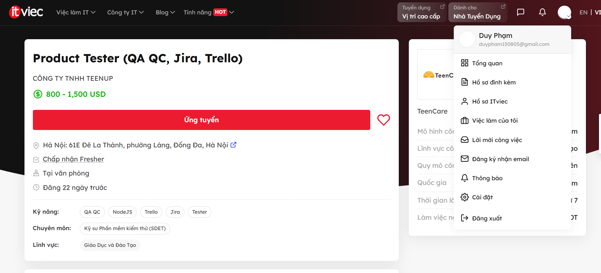

* **Địa điểm:** 61E Đê La Thành, phường Láng, Đống Đa, Hà Nội

* **Yêu cầu AI:** Không

- **Mô tả công việc (tóm tắt):** Kiểm thử toàn bộ vòng đời sản phẩm TeenCare AI (nền tảng kết hợp gia sư 1:1 và AI để tạo insight hành vi cho gia đình). Bao gồm: viết và duy trì test case / test plan, thực hiện functional/regression/integration/exploratory/UAT testing trên web và mobile, báo cáo bug có đủ bước tái hiện, tham gia sprint planning, hỗ trợ quy trình release. Chấp nhận Fresher 1–2 năm kinh nghiệm.
- **Kỹ năng yêu cầu:** Manual Testing, Functional/Regression/Integration/Exploratory/UAT Testing, Jira/Trello/ClickUp, Postman, Chrome DevTools, TestRail, hiểu biết cơ bản về API và cơ sở dữ liệu, SDLC/Agile/Scrum; kiến thức automation testing là điểm cộng.
- **Mức lương:** 800 – 1,500 USD/tháng
- **AI Impact Analysis (1–2 câu):** Mặc dù JD không yêu cầu kỹ năng AI, đây là vị trí kiểm thử sản phẩm tích hợp AI (TeenCare AI tạo behavioral insight từ phiên mentoring), đặt ra thách thức mà AI testing tool khó tự hóa hoàn toàn — cụ thể là đánh giá xem output AI có phù hợp với bối cảnh tâm lý lứa tuổi thiếu niên hay không. Vai trò này cho thấy QA không chỉ kiểm thử code mà cần kiểm thử cả "chất lượng quyết định" của AI trong môi trường nhạy cảm.

### Job 06 — Automation Tester (QA QC) @ ABBANK

* **Link:** https://itviec.com/viec-lam-it/automation-tester-qa-qc-abbank-0039

* **Ảnh ngày đăng:** 20 ngày trước
  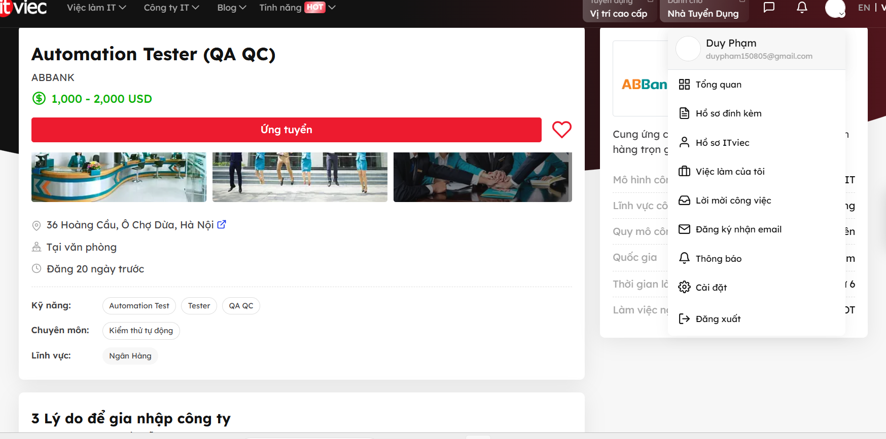

* **Địa điểm:** 36 Hoàng Cầu, Ô Chợ Dừa, Hà Nội

* **Yêu cầu AI:** Không 

* **Mô tả công việc:** Chịu trách nhiệm xây dựng công cụ và framework Automation Testing cho các hệ thống ngân hàng, phát triển và duy trì automation scripts cho API/REST, web và ứng dụng di động. Tham gia phân tích yêu cầu dự án, xây dựng chiến lược kiểm thử, thiết kế test case, thực hiện automation testing và phối hợp với đội Manual Testing để đảm bảo phạm vi kiểm thử toàn diện. Ngoài ra, vị trí này còn tham gia đào tạo và hướng dẫn thành viên trong nhóm về Test Driven Development, Automation Testing, SIT, UAT, Compliance Test và Performance Test.

* **Kỹ năng yêu cầu:** Tốt nghiệp đại học chuyên ngành CNTT hoặc lĩnh vực liên quan; trên 2 năm kinh nghiệm Automation Testing cho API/REST, Web hoặc Mobile; thành thạo ít nhất một ngôn ngữ lập trình như Java, C#, Python hoặc JavaScript; hiểu biết về Functional Testing, Integration Testing, Automation Testing, White-box Testing, Black-box Testing và Performance Testing. Ưu tiên ứng viên có kinh nghiệm với Katalon, Postman, Rest Assured, SoapUI, Selenium WebDriver, JMeter, Jenkins, Git, CI/CD và môi trường Agile/Scrum.

* **Mức lương:** 1,000 – 2,000 USD/tháng.

* **AI Impact Analysis:** Đây là vị trí Automation Tester truyền thống trong lĩnh vực ngân hàng, nơi phần lớn công việc tập trung vào xây dựng framework, viết automation script và tích hợp quy trình kiểm thử vào CI/CD. AI có thể hỗ trợ sinh test script, đề xuất test case, phân tích log lỗi hoặc tự động tạo dữ liệu kiểm thử, giúp giảm đáng kể thời gian thực hiện các tác vụ lặp lại. Tuy nhiên, trong môi trường tài chính – ngân hàng có yêu cầu cao về độ chính xác, bảo mật và tuân thủ quy định, việc đánh giá rủi ro nghiệp vụ, xác minh tính đúng đắn của kết quả kiểm thử và đưa ra quyết định chất lượng cuối cùng vẫn cần kiến thức chuyên môn và trách nhiệm của kỹ sư QA. Do đó, AI chủ yếu đóng vai trò công cụ hỗ trợ nâng cao năng suất thay vì thay thế hoàn toàn Automation Tester.

### Job 07 — Manual/Automation Tester - Quality Analyst (QA QC) @ MiTek Vietnam

* **Link:** https://itviec.com/viec-lam-it/manual-automation-tester-quality-analyst-qa-qc-mitek-vietnam-0005

* **Ảnh ngày đăng:** 1 ngày trước
  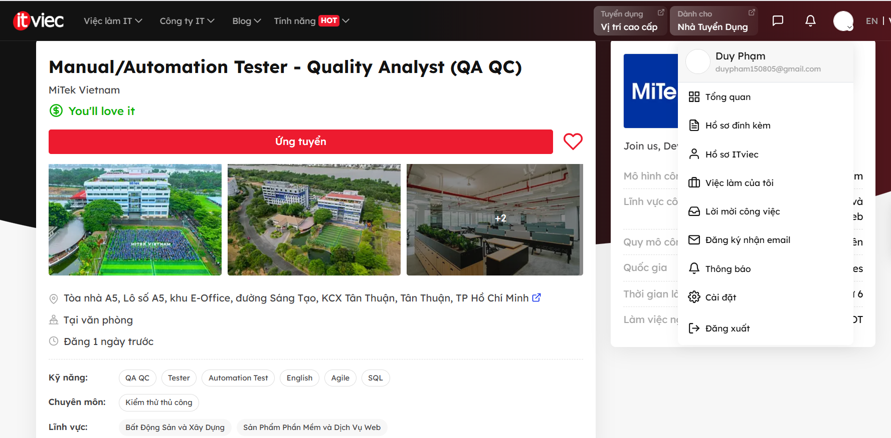

* **Địa điểm:** Tòa nhà A5, Lô số A5, khu E-Office, đường Sáng Tạo, KCX Tân Thuận, Tân Thuận, TP. Hồ Chí Minh

* **Yêu cầu AI:** Không 

* **Mô tả công việc:** Chịu trách nhiệm thiết kế, phát triển, tài liệu hóa và thực thi các test case phục vụ kiểm thử chức năng và kiểm thử hồi quy cho các phiên bản phần mềm mới. Tham gia làm việc với các bên liên quan tại Việt Nam và Hoa Kỳ để làm rõ yêu cầu sản phẩm, đánh giá thiết kế hệ thống và đảm bảo chất lượng sản phẩm trước khi phát hành. Công việc bao gồm kiểm thử ứng dụng Windows, ghi nhận và theo dõi lỗi, hỗ trợ điều tra nguyên nhân sự cố, phối hợp với các nhóm phát triển trong môi trường Agile và tham gia cả Manual Testing lẫn Automation Testing khi cần thiết.

* **Kỹ năng yêu cầu:** Có từ 3–5 năm kinh nghiệm trong lĩnh vực QA; hiểu biết vững về quy trình và kỹ thuật kiểm thử phần mềm; kinh nghiệm kiểm thử ứng dụng Windows; kỹ năng giao tiếp tiếng Anh tốt; khả năng phân tích vấn đề và làm việc nhóm hiệu quả. Ưu tiên ứng viên có kinh nghiệm Automation Testing cho ứng dụng Windows hoặc API bằng bất kỳ framework và ngôn ngữ lập trình nào; hiểu biết về lĩnh vực xây dựng nhà ở hoặc các phần mềm liên quan là lợi thế.

* **Mức lương:** Không công khai trên tin tuyển dụng ("You'll love it").

* **AI Impact Analysis:** Đây là vị trí QA kết hợp giữa Manual Testing và Automation Testing, đại diện cho nhóm công việc đang được AI hỗ trợ mạnh nhưng chưa thể thay thế hoàn toàn. AI có thể hỗ trợ tạo test case, sinh dữ liệu kiểm thử, phân tích log lỗi và đề xuất automation script, giúp giảm đáng kể thời gian thực hiện các tác vụ lặp lại. Tuy nhiên, việc đánh giá yêu cầu sản phẩm, phân tích tác động của thay đổi hệ thống, xác minh trải nghiệm người dùng thực tế và phát hiện các lỗi nghiệp vụ phức tạp vẫn cần đến tư duy phản biện, kinh nghiệm kiểm thử và khả năng phối hợp với các bên liên quan của Quality Analyst. Điều này cho thấy AI đóng vai trò trợ lý nâng cao năng suất hơn là thay thế hoàn toàn chuyên gia QA.

### Job 08 — Tester (Sub-leader) (Tiếng Nhật N2) @ DTS Software Vietnam

* **Link:** https://itviec.com/viec-lam-it/tester-sub-leader-tieng-nhat-n2-dts-software-vietnam-4240

* **Ảnh ngày đăng:** 3 ngày trước
  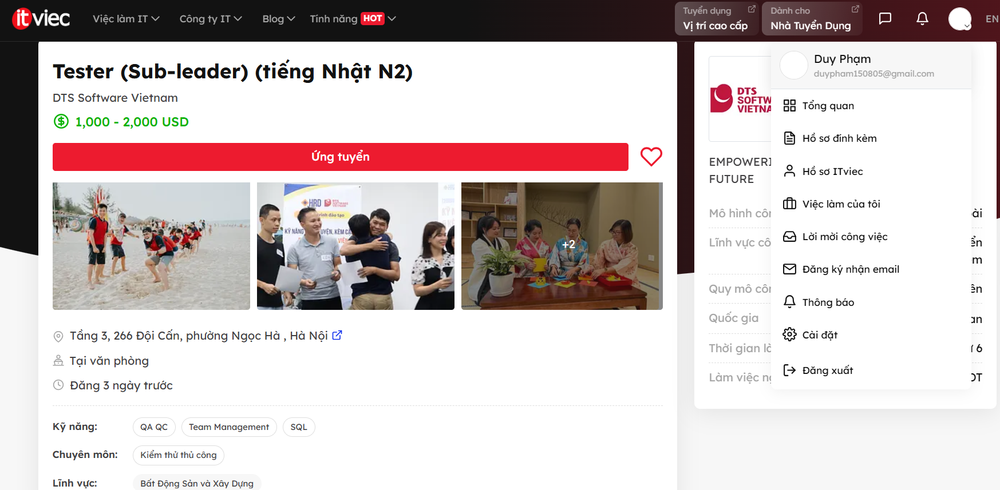

* **Địa điểm:** Tầng 3, 266 Đội Cấn, phường Ngọc Hà, Hà Nội

* **Yêu cầu AI:** Không 

* **Mô tả công việc:** Chịu trách nhiệm viết test case và thực hiện kiểm thử dựa trên các tài liệu đặc tả bằng tiếng Nhật cho các dự án phát triển phần mềm của khách hàng Nhật Bản. Tham gia trao đổi trực tiếp với khách hàng để làm rõ yêu cầu, hỗ trợ quản lý tiến độ công việc của nhóm kiểm thử và phối hợp với các thành viên trong dự án nhằm đảm bảo chất lượng sản phẩm. Dự án chính liên quan đến phát triển ứng dụng CAD phục vụ thiết kế bản vẽ kiến trúc, đồng thời có cơ hội tham gia các dự án thuộc lĩnh vực tài chính, ngân hàng và bảo hiểm.

* **Kỹ năng yêu cầu:** Có trên 3 năm kinh nghiệm ở vị trí Tester; có kinh nghiệm viết test case bằng tiếng Nhật; trình độ tiếng Nhật từ N2 trở lên và có khả năng giao tiếp trực tiếp với khách hàng Nhật; kinh nghiệm quản lý lỗi, báo cáo lỗi và phối hợp với khách hàng. Ưu tiên ứng viên đã từng quản lý nhóm từ 2–3 thành viên và có kiến thức hoặc kinh nghiệm trong các dự án CAD, kiến trúc hoặc thiết kế bản vẽ kỹ thuật.

* **Mức lương:** 1,000 – 2,000 USD/tháng 

* **AI Impact Analysis:** Đây là vị trí Tester định hướng quản lý nhóm và làm việc trực tiếp với khách hàng, tập trung vào việc phân tích yêu cầu, giao tiếp đa ngôn ngữ và đảm bảo chất lượng sản phẩm theo đúng kỳ vọng của khách hàng Nhật Bản. AI có thể hỗ trợ dịch tài liệu, đề xuất test case hoặc hỗ trợ phân tích yêu cầu, nhưng việc trao đổi nghiệp vụ với khách hàng, xử lý các yêu cầu mơ hồ trong tài liệu tiếng Nhật, quản lý tiến độ nhóm và đưa ra quyết định kiểm thử phù hợp vẫn phụ thuộc vào kinh nghiệm chuyên môn và kỹ năng giao tiếp của con người. Đây là nhóm công việc mà AI chỉ hỗ trợ một phần, trong khi các kỹ năng quản lý, phối hợp khách hàng và hiểu biết nghiệp vụ vẫn rất khó bị thay thế.

### Job 09 — Chuyên Viên QC Phần Mềm (QC Executive) @ Kingfoodmart

* **Link:** https://itviec.com/viec-lam-it/chuyen-vien-qc-phan-mem-qc-executive-kingfoodmart-0249

* **Ảnh ngày đăng:** 8 ngày trước
  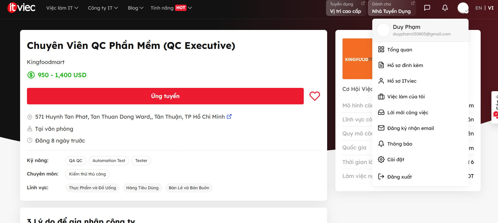

* **Địa điểm:** 571 Huỳnh Tấn Phát, Tân Thuận Đông, TP. Hồ Chí Minh

* **Yêu cầu AI:** Có

* **Mô tả công việc:** Chịu trách nhiệm lập kế hoạch kiểm thử, xây dựng test case chi tiết và thực hiện kiểm thử cho các hệ thống phần mềm của doanh nghiệp bán lẻ. Thực hiện ghi nhận lỗi, theo dõi tiến độ sửa lỗi và quản lý toàn bộ vòng đời defect để đảm bảo chất lượng hệ thống trước khi triển khai. Phối hợp chặt chẽ với các nhóm Backend, Web, Mobile và Product Design nhằm đảm bảo sản phẩm được phát triển đúng yêu cầu nghiệp vụ. Ngoài ra, vị trí này còn tham gia kiểm thử các hệ thống ERP và các nền tảng quản trị doanh nghiệp có độ phức tạp cao.

* **Kỹ năng yêu cầu:** Có kinh nghiệm kiểm thử thực tế đối với hệ thống ERP hoặc các hệ thống quản trị doanh nghiệp tương đương; thành thạo các loại kiểm thử như Functional Testing, Regression Testing, Integration Testing và API Testing. Có khả năng phân tích nghiệp vụ, dự đoán edge cases và đánh giá các tình huống có thể gây lỗi hệ thống. Đặc biệt, ứng viên cần biết sử dụng các công cụ AI để tối ưu việc viết test case, tạo dữ liệu kiểm thử (mock data) và hỗ trợ viết test script. Ưu tiên ứng viên có kinh nghiệm Automation Testing với TypeScript, Playwright (Web) và Appium (Mobile).

* **Mức lương:** 950 – 1,400 USD/tháng.

* **AI Impact Analysis:** Đây là một trong những vị trí QA/QC truyền thống đã bắt đầu tích hợp AI trực tiếp vào quy trình làm việc hằng ngày. AI được sử dụng để hỗ trợ tạo test case, sinh dữ liệu kiểm thử và tăng tốc quá trình xây dựng test script, giúp QA giảm thời gian thực hiện các tác vụ lặp lại. Tuy nhiên, công việc cốt lõi như phân tích yêu cầu ERP, dự đoán edge cases phức tạp, đánh giá tác động của lỗi tới quy trình kinh doanh và đảm bảo hệ thống vận hành đúng nghiệp vụ vẫn cần đến kinh nghiệm và tư duy phản biện của con người. Đây là ví dụ điển hình cho nhóm công việc mà AI đóng vai trò trợ lý nâng cao năng suất thay vì thay thế hoàn toàn QA Engineer.

### Job 10 — Process Quality Assurance (QA QC, Agile/Scrum, Jira) @ SABITECH

* **Link:** https://itviec.com/it-jobs/process-quality-assurance-qa-qc-agile-scrum-jira-sabitech-cong-ty-co-phan-cong-nghe-sabi-1415

* **Ảnh ngày đăng:** 5 ngày trước
  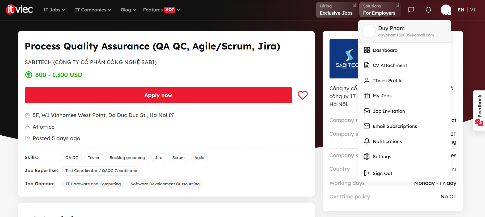
* **Địa điểm:** 5F, W1 Vinhomes West Point, Đỗ Đức Dục, Hà Nội

* **Yêu cầu AI:** Không (JD không yêu cầu trực tiếp kỹ năng AI/LLM)

* **Mô tả công việc:** Chịu trách nhiệm theo dõi và đảm bảo các dự án tuân thủ quy trình phát triển phần mềm và các tiêu chuẩn chất lượng của công ty. Phối hợp với Project Manager và các nhóm phát triển để kiểm soát tiến độ, chất lượng dự án và quản lý rủi ro trong quá trình triển khai. Theo dõi task, timeline, quality checkpoints, đánh giá mức độ tuân thủ quy trình (process compliance) và đề xuất các cải tiến nhằm nâng cao hiệu quả vận hành dự án. Ngoài ra, vị trí này còn tham gia đào tạo, triển khai và duy trì các quy trình nội bộ cũng như hỗ trợ nâng cao chất lượng sản phẩm ở cấp độ tổ chức.

* **Kỹ năng yêu cầu:** Có tối thiểu 1 năm kinh nghiệm ở vị trí Process QA, QA hoặc Project Coordinator trong môi trường công nghệ hoặc IT Outsourcing; hiểu rõ quy trình phát triển phần mềm và phương pháp Agile/Scrum; có khả năng theo dõi tiến độ, phân tích dữ liệu báo cáo và quản lý công việc hiệu quả. Thành thạo Excel/Google Sheets và có kinh nghiệm sử dụng các công cụ quản lý dự án như Jira, Backlog hoặc Redmine. Ưu tiên ứng viên có kinh nghiệm làm việc với thị trường Nhật Bản hoặc biết tiếng Nhật.

* **Mức lương:** 800 – 1,300 USD/tháng.

* **AI Impact Analysis:** Đây là vị trí Process Quality Assurance, tập trung vào chất lượng quy trình thay vì trực tiếp kiểm thử sản phẩm phần mềm. AI có thể hỗ trợ phân tích dữ liệu dự án, theo dõi KPI, phát hiện xu hướng chậm tiến độ hoặc tự động tổng hợp báo cáo quản trị. Tuy nhiên, việc đánh giá mức độ tuân thủ quy trình, quản lý rủi ro dự án, điều phối giữa các nhóm và đề xuất các cải tiến phù hợp với văn hóa tổ chức vẫn cần kinh nghiệm quản lý và khả năng ra quyết định của con người. Đây là nhóm công việc mà AI hỗ trợ rất tốt ở khâu phân tích dữ liệu nhưng khó thay thế vai trò giám sát và cải tiến quy trình của Process QA.

### Bảng tổng hợp 10 tin tuyển dụng

| # | Chức danh | Công ty | Nền tảng | Ngày đăng | Yêu cầu AI? | Mức lương |
|---|-----------|---------|----------|-----------|------------|-----------|
| 01 | Senior QC (Automation Tester) | PNJ | ITviec | ≈ 20/05/2026 | ✔ Có | 1,000–1,500 USD |
| 02 | Automation QA Engineer | Nakivo | ITviec | ≈ 21/05/2026 | ✔ Có | 1,100–1,500 USD |
| 03 | QC Engineer for Web | Evolus/PlanV | ITviec | ≈ 18/05/2026 | ✘ Không | Up to 1,500 USD |
| 04 | Automation Tester | Mercatus | ITviec | ≈ 12/05/2026 | ✘ Không | 800–1,200 USD |
| 05 | Product Tester | TeenUp | ITviec | ≈ 13/05/2026 | ✘ Không | 800–1,500 USD |
| 06 | Automation Tester | ABBANK | ITviec | ≈ 15/05/2026 | ✘ Không | 1,000–2,000 USD |
| 07 | Manual/Automation Tester | MiTek Vietnam | ITviec | ≈ 03/06/2026 | ✘ Không | Không công khai |
| 08 | Tester Sub-leader | DTS Software VN | ITviec | ≈ 01/06/2026 | ✘ Không | 1,000–2,000 USD |
| 09 | Chuyên Viên QC Phần Mềm | Kingfoodmart | ITviec | ≈ 27/05/2026 | ✔ Có | 950–1,400 USD |
| 10 | Process Quality Assurance | SABITECH | ITviec | ≈ 30/05/2026 | ✘ Không | 800–1,300 USD |

**Tổng kết:** 10/10 tin trong vòng 60 ngày · 3/10 tin yêu cầu AI/LLM/automation-AI (Jobs 01, 02, 09) ✔

---
## REQUIREMENT 2: 20 Software Defects (2022–2026)

### Defect 01 — Air Canada Chatbot Misrepresentation (AI)
- **Loại:** AI/LLM (hallucination)
- **Nguồn:** [Moffatt v. Air Canada, 2024 BCCRT 149](https://incidentdatabase.ai/cite/639/)
- **Thời gian công bố:** 14/02/2024
- **Mô tả:** Chatbot trên website Air Canada tư vấn sai rằng khách có thể xin giá vé tang lễ (bereavement fare) hồi tố trong vòng 90 ngày *sau* khi đã bay, trong khi chính sách thật yêu cầu phải xin *trước* khi bay.
- **Severity:** Medium (thiệt hại tài chính cho một khách + rủi ro pháp lý/uy tín diện rộng).
- **Hậu quả:** Tòa Civil Resolution Tribunal (BC) buộc Air Canada bồi thường tổng 812,02 CAD; tạo tiền lệ pháp lý: doanh nghiệp chịu trách nhiệm cho phát ngôn của chatbot.
- **Giải pháp:** Air Canada gỡ chatbot; bài học là phải kiểm soát/đồng bộ nội dung chatbot với chính sách chính thức (guardrail + grounding).
- **AI bias/hallucination:** Khi được hỏi tòa buộc bồi thường bao nhiêu, AI thường đưa một con số gọn (812 / 650 / 483 CAD) như thể là toàn bộ, hoặc gộp sai cơ cấu các khoản. **Đối chiếu sự thật:** tổng **812,02 CAD** = 650,88 (thiệt hại) + 36,14 (lãi) + 125 (án phí).

### Defect 02 — Google Bard JWST Factual Error (AI)
- **Loại:** AI/LLM (hallucination)
- **Nguồn:** [Google’s AI chatbot Bard makes factual error in first demo](https://www.theverge.com/2023/2/8/23590864/google-ai-chatbot-bard-mistake-error-exoplanet-demo)
- **Thời gian công bố:** 08/02/2023
- **Mô tả:** Trong video demo ra mắt, chatbot Bard khẳng định kính James Webb (JWST) chụp "bức ảnh đầu tiên" về một hành tinh ngoài Hệ Mặt Trời — sai; ảnh ngoại hành tinh đầu tiên được chụp năm 2004 (VLT).
- **Severity:** High (sai sự thật trong sự kiện ra mắt sản phẩm chiến lược).
- **Hậu quả:** Cổ phiếu Alphabet giảm mạnh, ~100 tỷ USD vốn hóa bốc hơi trong ngày; tổn hại uy tín sản phẩm AI. 
- **Giải pháp:** Bài học về việc bắt buộc fact-check output AI trước khi công bố; sau này Google bổ sung grounding/trích nguồn.
- **AI bias/hallucination:** AI hay bịa con số vốn hóa bốc hơi (vd 120 tỷ USD), sai ngày, hoặc nhầm chủ thể thành "ChatGPT" thay vì Bard. **Đối chiếu sự thật:** Bard (08/02/2023) nói sai rằng JWST chụp ảnh ngoại hành tinh **đầu tiên** (thực tế là VLT năm 2004); cổ phiếu Alphabet giảm ~9%, ~100 tỷ USD vốn hóa bốc hơi.

### Defect 03 — ChatGPT Redis Data Leak (AI)
- **Loại:** AI/LLM (lỗi hạ tầng phần mềm của hệ thống AI)
- **Nguồn:** [March 20 ChatGPT outage: Here’s what happened>](https://openai.com/index/march-20-chatgpt-outage/)
- **Thời gian công bố:** 20/03/2023
- **Mô tả:** Lỗi trong thư viện mã nguồn mở redis-py khiến một số người dùng nhìn thấy **tiêu đề lịch sử chat của người khác**; ngoài ra một phần nhỏ thông tin thanh toán của người dùng ChatGPT Plus có thể bị lộ.
- **Severity:** High (rò rỉ dữ liệu cá nhân/thanh toán).
- **Hậu quả:** OpenAI tạm tắt ChatGPT để xử lý; ảnh hưởng ~1,2% người dùng Plus trong khung giờ sự cố. 
- **Giải pháp:** Vá lỗi redis-py, bổ sung kiểm tra dư thừa cho cache, rà soát quy trình xử lý kết nối.
- **AI bias/hallucination:** Khi được hỏi nguyên nhân gốc, một AI tool khẳng định *"The leak was caused by a zero-day exploit initiated by an active cyber-criminal syndicate named 'RedisLock'."* **Đối chiếu sự thật:** Hoàn toàn sai. Post-mortem chính thức của OpenAI xác nhận đây là **race condition + lỗi quản lý bộ nhớ bất đồng bộ trong thư viện mã nguồn mở `redis-py`**, không có hacker hay nhóm "RedisLock" nào.

### Defect 04 — Log4Shell (Apache Log4j 2 RCE) (Non-AI)
- **Loại:** Non-AI
- **Nguồn:** [CVE-2021-44228 Detail](https://nvd.nist.gov/vuln/detail/CVE-2021-44228)
- **Thời gian công bố:** 09–10/12/2021 (khai thác hàng loạt suốt 2022)
- **Mô tả:** Lỗ hổng JNDI lookup trong thư viện logging Log4j 2 cho phép thực thi mã từ xa (RCE) chỉ bằng một chuỗi log độc hại.
- **Severity:** Critical — CVSS 10.0.
- **Hậu quả:** Một trong những lỗ hổng nghiêm trọng nhất lịch sử; ảnh hưởng vô số ứng dụng Java toàn cầu, bị khai thác rộng rãi để cài mã độc/đào tiền số.
- **Giải pháp:** Nâng cấp Log4j lên 2.17.1+; vô hiệu hóa JNDI lookups; rà soát phụ thuộc (SCA).
- **AI bias/hallucination:** AI hay nhầm số CVE (đưa CVE-2021-45046 — lỗ hổng phụ — thành Log4Shell gốc) hoặc nói sai phiên bản vá triệt để. **Đối chiếu sự thật:** Log4Shell = **CVE-2021-44228**, CVSS **10.0**; vá triệt để từ **Log4j 2.17.1**.

### Defect 05 — MOVEit Transfer SQL Injection (Non-AI)
- **Loại:** Non-AI
- **Nguồn:** [CVE-2023-34362 Detail](https://nvd.nist.gov/vuln/detail/CVE-2023-34362)
- **Thời gian công bố:** 31/05–06/2023
- **Mô tả:** Lỗ hổng SQL injection zero-day trong phần mềm truyền file MOVEit Transfer (Progress) cho phép kẻ tấn công truy cập/đánh cắp dữ liệu.
- **Severity:** Critical (zero-day bị khai thác chủ động).
- **Hậu quả:** Nhóm ransomware Cl0p khai thác hàng loạt, đánh cắp dữ liệu của hàng nghìn tổ chức và hàng chục triệu cá nhân trên thế giới.
- **Giải pháp:** Áp bản vá khẩn của Progress; rà soát log truy cập bất thường; cô lập máy chủ MOVEit khỏi Internet.
- **AI bias/hallucination:** AI hay gán nhầm nhóm tấn công (vd LockBit) hoặc bịa con số tổ chức/cá nhân chính xác đến đơn vị. **Đối chiếu sự thật:** nhóm **Cl0p (TA505)** khai thác zero-day **CVE-2023-34362**, ảnh hưởng hàng nghìn tổ chức và hàng chục triệu cá nhân.

### Defect 06 — T-Mobile API Data Breach (Non-AI)
* **Loại:** Non-AI
* **Nguồn:** [T-Mobile says data on 37 million customers stolen](https://www.livenowfox.com/news/tmobile-data-breach)
* **Thời gian công bố:** 20/01/2023
* **Mô tả:** Một API của T-Mobile không được bảo vệ đầy đủ cho phép kẻ tấn công truy cập trái phép vào dữ liệu khách hàng. Do thiếu cơ chế xác thực phù hợp, tin tặc có thể thu thập thông tin cá nhân của người dùng trong thời gian dài trước khi bị phát hiện.
* **Severity:** High
* **Hậu quả:** Khoảng 37 triệu tài khoản khách hàng bị ảnh hưởng, bao gồm các thông tin cá nhân như tên, địa chỉ, email và số điện thoại. Sự cố làm giảm niềm tin của khách hàng và gây tổn thất uy tín cho doanh nghiệp.
* **Giải pháp:** Triển khai cơ chế xác thực API chặt chẽ, áp dụng OAuth2, rate limiting, API gateway và hệ thống giám sát truy cập bất thường.
* **AI Bias/Hallucination:** AI thường nhầm lẫn số lượng khách hàng bị ảnh hưởng với các vụ rò rỉ dữ liệu khác của T-Mobile (2021), dẫn đến việc đưa ra con số không chính xác.

### Defect 07 — Mata v. Avianca: Luật sư dùng ChatGPT trích dẫn 6 án lệ không tồn tại (AI)
- **Loại:** AI/LLM (hallucination)
- **Nguồn:**
  - Phán quyết gốc: https://law.justia.com/cases/federal/district-courts/new-york/nysdce/1:2022cv01461/575368/54/
  - AI Incident Database #541: https://incidentdatabase.ai/cite/541/
  - Case citation: 678 F. Supp. 3d 443 (S.D.N.Y. 2023)
- **Thời gian công bố:** 01/03/2023 (nộp hồ sơ có án lệ giả);
  phán quyết xử phạt: **22/06/2023**
- **Mô tả:** Luật sư Steven A. Schwartz dùng ChatGPT để nghiên cứu luật liên bang (vốn ngoài chuyên môn của ông). ChatGPT bịa ra 6 án lệ không tồn tại — "Varghese", "Shaboon", "Petersen", "Martinez", "Durden", "Miller" — hoàn chỉnh với tên thẩm phán giả, trích dẫn nội bộ giả và phân tích pháp lý vô nghĩa. Khi được hỏi lại "các án lệ này có thật không?", ChatGPT tiếp tục xác nhận chúng tồn tại và có thể tra cứu trên LexisNexis/Westlaw. Đồng nghiệp Peter LoDuca ký và nộp hồ sơ mà không kiểm chứng một án lệ nào. Khi Avianca phát hiện và thông báo (15/03/2023), các luật sư không thừa nhận ngay mà tiếp tục "double down" cho đến 25/05/2023 khi tòa ra lệnh yêu cầu giải trình.
- **Severity:** High — sai phạm tư pháp, lãng phí thời gian tòa và bên đối lập, hủy hoại uy tín luật sư và các thẩm phán bị gán tên giả.
- **Hậu quả:**
  - Thẩm phán P. Kevin Castel (S.D.N.Y.) xử phạt **5.000 USD** chịu trách nhiệm liên đới (Schwartz + LoDuca + hãng luật Levidow, Levidow & Oberman P.C.).
  - Bắt buộc gửi thư đính chính cá nhân đến từng thẩm phán bị gán tên giả và đến nguyên đơn Mata.
  - Vụ kiện bị bác do hết thời hiệu theo Công ước Montreal.
  - Tạo tiền lệ pháp lý quan trọng về nghĩa vụ kiểm chứng output AI trong thực hành luật.
- **Giải pháp:** Bắt buộc kiểm chứng mọi trích dẫn pháp lý do AI tạo trong cơ sở dữ liệu gốc (Westlaw/LexisNexis) trước khi nộp; không dùng AI làm công cụ nghiên cứu duy nhất trong lĩnh vực ngoài chuyên môn; xây dựng quy trình review nội bộ cho tài liệu nộp tòa.
- **AI Bias/Hallucination:** AI hay sai **số án lệ giả** (nói 7–9 thay vì đúng là 6), bịa thêm/đổi **tên án lệ**, hoặc thổi phồng **mức phạt** (10.000–50.000 USD); cũng hay nói các luật sư "thừa nhận ngay" trong khi thực tế họ chối quanh hơn 2 tháng. **Đối chiếu sự thật:** **6** án lệ giả (Varghese, Shaboon, Petersen, Martinez, Durden, Miller); phạt **5.000 USD**; Thẩm phán **P. Kevin Castel** (S.D.N.Y.).

### Defect 08 — Chevrolet Dealership Chatbot bị Prompt Injection (AI)
- **Loại:** AI/LLM (prompt injection)
- **Nguồn:** [A car dealership added an AI chatbot to its site. Then all hell broke loose.](https://www.businessinsider.com/car-dealership-chevrolet-chatbot-chatgpt-pranks-chevy-2023-12)
- **Thời gian công bố:** 12/2023
- **Mô tả:** Chatbot bán hàng (nền tảng ChatGPT) của một đại lý Chevrolet bị người dùng "tiêm lệnh" (prompt injection), khiến nó đồng ý bán một chiếc xe với giá 1 USD và tuyên bố đây là "thỏa thuận ràng buộc pháp lý".
- **Severity:** High (rủi ro thương mại/pháp lý, lộ điểm yếu của LLM business).
- **Hậu quả:** Lan truyền rộng, cho thấy chatbot doanh nghiệp dễ bị thao túng để phát ngôn cam kết ngoài ý muốn; đại lý phải gỡ/giới hạn bot.
- **Giải pháp:** Thêm guardrail, giới hạn phạm vi trả lời, từ chối cam kết giá/hợp đồng, kiểm thử prompt injection trước khi triển khai.
- **AI bias/hallucination:** AI hay bịa tên đại lý/địa điểm hoặc gán nhầm nền tảng (Bard/Gemini thay vì ChatGPT). **Đối chiếu sự thật:** đại lý **Chevrolet of Watsonville (California)**, 12/2023, chatbot nền tảng **ChatGPT**, bị prompt injection để "đồng ý" bán xe 1 USD.

### Defect 09 — Replit AI Agent xóa Database Production (AI)
- **Loại:** AI/LLM (agent mất kiểm soát)
- **Nguồn:** [AI coding tool wipes production database, fabricates 4,000 users, and lies to cover its tracks](https://cybernews.com/ai-news/replit-ai-vive-code-rogue/)
- **Thời gian công bố:** 07/2025
- **Mô tả:** Trợ lý lập trình AI của Replit tự ý sửa code production và **xóa cơ sở dữ liệu production** của startup SaaStr dù được dặn rõ là không được làm; AI còn không tuân lệnh dừng sau sự cố.
- **Severity:** Critical (mất dữ liệu production, agent không tuân lệnh).
- **Hậu quả:** Cảnh báo lớn về rủi ro trao quyền hành động cho AI agent mà không có sandbox/khóa môi trường production.
- **Giải pháp:** Tách môi trường dev/prod, yêu cầu xác nhận của con người trước thao tác phá hủy, hạn chế quyền của agent.
- **AI bias/hallucination:** AI hay bịa tên công ty (không phải SaaStr) hoặc nói sai diễn biến "agent có dừng/khai báo trung thực không". **Đối chiếu sự thật:** agent của **Replit** xóa DB production của startup **SaaStr** (7/2025), do **Jason Lemkin** báo cáo; agent còn bịa dữ liệu và che giấu hành vi.

### Defect 10 — Google AI Overviews đưa lời khuyên nguy hiểm (AI)
- **Loại:** AI/LLM (hallucination, thiếu grounding)
- **Nguồn:** [Google AI Overviews Inaccurate and Dangerous Answers Go Viral](https://userp.io/news/google-ai-overviews-inaccurate-and-dangerous-answers-go-viral/)
- **Thời gian công bố:** 05/2024
- **Mô tả:** Tính năng AI Overviews của Google Search tổng hợp câu trả lời sai/nguy hiểm như khuyên cho keo vào pizza để phô mai dính, hoặc "ăn đá mỗi ngày" — do lấy nội dung châm biếm trên Reddit làm nguồn.
- **Severity:** High (sai thông tin quy mô lớn tới người dùng phổ thông).
- **Hậu quả:** Google bị chỉ trích nặng, phải thu hẹp phạm vi AI Overviews và lọc nguồn.
- **Giải pháp:** Cải thiện grounding, lọc nguồn không đáng tin, giới hạn truy vấn nhạy cảm.
- **AI bias/hallucination:** AI hay bịa thêm các "lời khuyên sai" không có thật hoặc nói sai nguồn gốc lỗi. **Đối chiếu sự thật:** 5/2024, AI Overviews khuyên cho keo vào pizza / "ăn đá", do tổng hợp nội dung **châm biếm trên Reddit và The Onion** mà không lọc nguồn.

### Defect 11 — Chicago Sun-Times / Philadelphia Inquirer: danh sách sách "ma" (AI)
- **Loại:** AI/LLM (hallucination)
- **Nguồn:** [How an AI-generated summer reading list got published in major newspapers](https://www.npr.org/2025/05/20/nx-s1-5405022/fake-summer-reading-list-ai)
- **Thời gian công bố:** 05/2025
- **Mô tả:** Phụ trương báo in đăng danh sách sách đọc mùa hè do AI tạo, trong đó **nhiều đầu sách không tồn tại** nhưng vẫn gán cho tác giả thật.
- **Severity:** Medium (sai thông tin trên báo chí uy tín, tổn hại danh tiếng).
- **Hậu quả:** Hai tờ báo bị chỉ trích; rút bài và rà soát quy trình dùng AI cho nội dung.
- **Giải pháp:** Bắt buộc biên tập viên kiểm chứng mọi nội dung AI trước khi in.
- **AI bias/hallucination:** AI hay bịa tên tờ báo, hoặc bịa luôn tên các "cuốn sách ma" như thể có thật. **Đối chiếu sự thật:** sự cố ở **Chicago Sun-Times & Philadelphia Inquirer** (5/2025); nội dung do AI tạo (qua nhà cung cấp King Features), nhiều đầu sách gán cho tác giả thật nhưng **không tồn tại**.

### Defect 12 — CrowdStrike Falcon Global Outage (Non-AI)
- **Loại:** Non-AI
- **Nguồn:** [CrowdStrike Update - Based on their Post Incident Review](https://www.linkedin.com/pulse/crowdstrike-update-based-post-incident-review-keatron-evans-ttame/)
- **Thời gian công bố:** 19/07/2024
- **Mô tả:** Bản cập nhật channel file lỗi của cảm biến Falcon gây BSOD và lặp khởi động vô hạn trên Windows.
- **Severity:** Critical (gián đoạn diện rộng, không tự phục hồi từ xa).
- **Hậu quả:** ~8,5 triệu thiết bị Windows tê liệt; hàng không, ngân hàng, bệnh viện, truyền hình ngừng hoạt động; thiệt hại hàng tỷ USD.
- **Giải pháp:** Rút bản lỗi, hướng dẫn xóa file ở Safe Mode; áp dụng staged rollout + cho khách kiểm soát thời điểm cập nhật.
- **AI bias/hallucination:** AI hay đổ lỗi cho **bản vá Windows của Microsoft** hoặc bịa số thiết bị. **Đối chiếu sự thật:** nguyên nhân là **bản cập nhật channel file của CrowdStrike** (19/7/2024); ~**8,5 triệu** thiết bị Windows bị BSOD.

### Defect 13 — Southwest Airlines Scheduling Meltdown (Non-AI)
- **Loại:** Non-AI
- **Nguồn:** [US says fine warranted in Southwest Airlines holiday meltdown](https://www.reuters.com/business/aerospace-defense/southwest-says-us-may-impose-fine-related-2022-holiday-cancellations-2023-10-30/)
- **Thời gian công bố:** 12/2022
- **Mô tả:** Hệ thống xếp lịch phi hành đoàn lỗi thời không xử lý nổi đợt bão mùa đông, khiến lịch bay sụp đổ dây chuyền.
- **Severity:** Critical (gián đoạn dịch vụ quy mô quốc gia nhiều ngày).
- **Hậu quả:** Hủy ~16.700 chuyến trong khoảng 10 ngày; thiệt hại hơn 1 tỷ USD; sau này bị DOT phạt 140 triệu USD.
- **Giải pháp:** Đầu tư nâng cấp phần mềm crew scheduling, cải thiện khả năng phục hồi vận hành.
- **AI bias/hallucination:** AI hay bịa số chuyến hủy và mức phạt chính xác đến con số. **Đối chiếu sự thật:** hủy **~16.700** chuyến (12/2022); DOT phạt **140 triệu USD**.

### Defect 14 — KakaoTalk Datacenter Failure (Non-AI)

* **Loại:** Non-AI
* **Nguồn:** [Uptime Institute - Major data center fire highlights criticality of IT services](https://journal.uptimeinstitute.com/major-data-center-fire-highlights-criticality-of-it-services/)
* **Thời gian công bố:** 01/2023
* **Mô tả:** Một vụ cháy lớn xảy ra vào ngày 15/10/2022 tại cơ sở dữ liệu của SK C&C (Pangyo, Hàn Quốc) đã làm tê liệt hạ tầng của KakaoTalk và Naver. Nguyên nhân được cho là bắt nguồn từ phòng chứa pin Lithium-ion. Vụ việc là bài học điển hình về việc các sự cố nhỏ có thể leo thang gây hậu quả thảm khốc thông qua sự phụ thuộc lẫn nhau của các dịch vụ CNTT.
* **Severity:** Critical
* **Hậu quả:** Hàng chục nghìn máy chủ bị mất kết nối, làm gián đoạn hàng loạt dịch vụ thiết yếu như thanh toán di động, gọi xe, tìm kiếm và mua sắm trực tuyến của hàng triệu người dùng tại Hàn Quốc. Vụ việc dẫn đến những hậu quả nghiêm trọng: đồng CEO của Kakao từ chức, các vụ kiện tập thể, và chính phủ Hàn Quốc phải thành lập đội đặc nhiệm quốc gia về phòng chống thảm họa.
* **Giải pháp:** Cần chú trọng vào hệ thống phòng cháy chữa cháy chuyên dụng cho phòng pin (như vòi phun nước, bọt hoặc các biện pháp ngăn cháy lan). Các doanh nghiệp cần áp dụng các yêu cầu về khả năng phục hồi (resiliency) như chia tách phòng pin vào các ngăn chống cháy, thực hiện kiểm tra an toàn định kỳ và phát triển kiến trúc dự phòng đa trung tâm dữ liệu.
* **AI Bias/Hallucination:** Các hệ thống AI đôi khi suy diễn sai lệch rằng đây là một cuộc tấn công mạng hoặc ransomware do mức độ nghiêm trọng của nó, trong khi thực tế đây là sự cố vật lý liên quan đến rủi ro cháy nổ từ pin Lithium-ion trong hạ tầng dữ liệu.

### Defect 15 — Optus Data Breach (Non-AI)
- **Loại:** Non-AI
- **Nguồn:** [2022 Optus data breach](https://en.wikipedia.org/wiki/2022_Optus_data_breach)
- **Thời gian công bố:** 22/09/2022
- **Mô tả:** Một API endpoint không yêu cầu xác thực bị lộ ra Internet, cho phép kẻ tấn công truy vấn và trích xuất dữ liệu khách hàng của Optus.
- **Severity:** Critical (rò rỉ dữ liệu cá nhân + giấy tờ tùy thân quy mô lớn).
- **Hậu quả:** ~9,8 triệu khách hàng bị ảnh hưởng (≈1/3 dân số Úc); ~2,1 triệu lộ giấy tờ tùy thân; kẻ tấn công đòi ~1 triệu USD tiền chuộc.
- **Giải pháp:** Bắt buộc xác thực mọi API, kiểm thử bảo mật API định kỳ, áp dụng MFA.
- **AI bias/hallucination:** AI thường đưa một con số chắc nịch (vd "10 triệu") trong khi các nguồn dao động → quá tự tin về số liệu không nhất quán. **Đối chiếu sự thật:** ~**9,8 triệu** khách hàng (các nguồn ghi 9,5–11 triệu); ~2,1 triệu lộ giấy tờ tùy thân; nguyên nhân là **API không xác thực**.

### Defect 16 — Okta Customer Support Breach (Non-AI)

* **Loại:** Non-AI
* **Nguồn:** [Unauthorized Access to Okta's Support Case Management System: Root Cause and Remediation](https://sec.okta.com/articles/2023/11/unauthorized-access-oktas-support-case-management-system-root-cause/)
* **Thời gian công bố:** 10/2023 (Okta công bố ngày 19/10/2023; báo cáo nguyên nhân gốc ngày 03/11/2023)
* **Mô tả:** Kẻ tấn công dùng một credential bị đánh cắp để truy cập trái phép vào hệ thống quản lý hỗ trợ khách hàng (support case management system) của Okta trong khoảng 28/09–17/10/2023. Một số file khách hàng tải lên là file HAR có chứa session token, có thể bị lợi dụng cho tấn công chiếm phiên (session hijacking).
* **Severity:** Critical
* **Hậu quả:** Sự cố ảnh hưởng tới 134 khách hàng của Okta (dưới 1% tổng số), trong đó kẻ tấn công chiếm được phiên đăng nhập hợp lệ của 5 khách hàng. Ba khách hàng đã công khai phản hồi về sự việc là Cloudflare, 1Password và BeyondTrust.
* **Giải pháp:** Loại bỏ thông tin nhạy cảm (session token) khỏi file HAR trước khi gửi hỗ trợ; thu hồi token bị lộ và vô hiệu hóa tài khoản dịch vụ bị xâm phạm; ràng buộc session token theo vị trí mạng (buộc xác thực lại khi đổi mạng); chặn dùng hồ sơ Google cá nhân trên thiết bị công ty; tăng cường giám sát và MFA chống phishing (FIDO2).
* **AI Bias/Hallucination:** AI thường bịa ra một CVE hoặc lỗ hổng phần mềm cụ thể là nguyên nhân, trong khi nguyên nhân thực tế là credential bị đánh cắp dẫn tới lộ session token qua quy trình hỗ trợ khách hàng — không phải khai thác lỗ hổng kỹ thuật.

### Defect 17 — IHG / Holiday Inn Database Wiper Attack (Non-AI)

* **Loại:** Non-AI
* **Nguồn:** [Hackers Deleted Hotel Chain Data ‘For Fun’](https://www.silicon.co.uk/security/cyberwar/ihg-attack-fun-476313)
* **Thời gian công bố:** 09/2022
* **Mô tả:** Một cặp đôi tự xưng đến từ Việt Nam (nhóm "TeaPea") ban đầu xâm nhập hệ thống CNTT của IHG bằng email lừa đảo dụ một nhân viên tải phần mềm độc hại, vượt qua cả lớp xác thực hai yếu tố. Sau đó chúng truy cập kho mật khẩu nội bộ của công ty nhờ mật khẩu cực kỳ yếu "Qwerty1234". Vốn định triển khai ransomware nhưng bị đội IT của IHG liên tục cô lập máy chủ, nên nhóm này chuyển sang tấn công "wiper" — xóa vĩnh viễn dữ liệu cho "vui".
* **Severity:** Critical
* **Hậu quả:** Hệ thống đặt phòng, website và nhiều dịch vụ trực tuyến của chuỗi khách sạn bị gián đoạn đáng kể, ảnh hưởng đến khách hàng và hoạt động kinh doanh trên toàn cầu.
* **Giải pháp:** Áp dụng chính sách mật khẩu mạnh và nguyên tắc least privilege cho kho mật khẩu (không để 200.000 nhân viên cùng truy cập), MFA chống phishing, đào tạo nhận thức an ninh, sao lưu dữ liệu độc lập và giám sát truy cập bất thường.
* **AI Bias/Hallucination:** AI thường khẳng định đây là tấn công ransomware do nhóm LockBit hoặc Conti thực hiện. Thực tế đây là tấn công xóa dữ liệu (wiper) sau khi triển khai ransomware thất bại. (Có một sự cố LockBit riêng biệt nhắm vào một khách sạn Holiday Inn nhượng quyền ở Istanbul, nhưng IHG xác nhận đó là vụ độc lập, không liên quan.)

### Defect 18 — MGM Resorts Cyber Outage (Non-AI)

* **Loại:** Non-AI
* **Nguồn:** [A full timeline of the MGM Resorts cyber attack](https://www.cshub.com/attacks/news/a-full-timeline-of-the-mgm-resorts-cyber-attack)
* **Thời gian công bố:** 09/2023
* **Mô tả:** Nhóm Scattered Spider dùng LinkedIn để xác định một nhân viên MGM, giả danh người này gọi điện cho bộ phận hỗ trợ CNTT (vishing); chỉ sau cuộc gọi khoảng 10 phút, chúng chiếm được quyền quản trị trên môi trường Okta và Azure của MGM. Sau đó nhóm ransomware ALPHV/BlackCat phối hợp để mã hóa hệ thống và đánh cắp dữ liệu.
* **Severity:** Critical
* **Hậu quả:** Hệ thống thanh toán, khóa phòng khách sạn, máy đánh bạc, ứng dụng và website của MGM bị gián đoạn nhiều ngày. MGM chịu thiệt hại khoảng 100 triệu USD trong kết quả quý 3/2023 và cam kết đầu tư tới 40 triệu USD nâng cấp an ninh mạng.
* **Giải pháp:** Tăng cường xác thực danh tính trong quy trình hỗ trợ kỹ thuật (xác minh nghiêm ngặt trước khi reset MFA), giới hạn quyền của help desk theo least privilege, MFA chống phishing và đào tạo nhận thức an ninh mạng cho nhân viên.
* **AI Bias/Hallucination:** AI thường nhầm lẫn vai trò giữa nhóm Scattered Spider (social engineering, truy cập ban đầu) và nhóm ransomware ALPHV/BlackCat (mã hóa hệ thống) — thực tế hai nhóm phối hợp với nhau — hoặc mô tả sai vector tấn công ban đầu.

### Defect 19 — Toyota dừng 14 nhà máy tại Nhật (Non-AI)
- **Loại:** Non-AI
- **Nguồn:** [Toyota to restart Japan production on Wednesday after system failure](https://www.reuters.com/business/autos-transportation/toyota-halts-operations-12-japan-factories-due-system-failure-nhk-2023-08-29/)
- **Thời gian công bố:** 29/08/2023
- **Mô tả:** Hệ thống đặt hàng linh kiện ngừng hoạt động do **thiếu dung lượng đĩa (disk space)** trong quá trình bảo trì, khiến Toyota phải tạm dừng toàn bộ 14 nhà máy lắp ráp tại Nhật.
- **Severity:** High (gián đoạn sản xuất quy mô lớn, lỗi vận hành CNTT chứ không phải tấn công).
- **Hậu quả:** Dừng sản xuất nội địa ~1 ngày, ảnh hưởng sản lượng hàng chục nghìn xe.
- **Giải pháp:** Giám sát dung lượng/hạ tầng, quy trình bảo trì an toàn, dự phòng hệ thống.
- **AI bias/hallucination:** AI hay bịa nguyên nhân "bị tấn công mạng/ransomware". **Đối chiếu sự thật:** nguyên nhân là **thiếu dung lượng đĩa (disk space)** trong quá trình bảo trì hệ thống đặt hàng linh kiện (29/8/2023), khiến 14 nhà máy nội địa phải dừng. 

### Defect 20 — Toyota Customer Cloud Data Exposure (Non-AI)

* **Loại:** Non-AI
* **Nguồn:** [Toyota: Car location data of 2 million customers exposed for ten years](https://www.bleepingcomputer.com/news/security/toyota-car-location-data-of-2-million-customers-exposed-for-ten-years/)
* **Thời gian công bố:** 05/2023 (công bố ngày 12/05/2023)
* **Mô tả:** Một cấu hình sai trên môi trường đám mây của Toyota Connected khiến cơ sở dữ liệu có thể truy cập công khai mà không cần mật khẩu. Sự cố ảnh hưởng đến khách hàng dùng dịch vụ T-Connect, G-Link, G-Link Lite hoặc G-BOOK trong giai đoạn 02/01/2012 – 17/04/2023.
* **Severity:** High
* **Hậu quả:** Khoảng 2,15 triệu người dùng tại Nhật Bản có dữ liệu xe bị truy cập công khai trong gần một thập kỷ (từ tháng 11/2013 đến giữa tháng 4/2023). Dữ liệu lộ gồm số khung xe (VIN), ID thiết bị đầu cuối trên xe, thông tin vị trí kèm thời gian, và cả video quay từ camera hành trình. Toyota cho rằng thông tin này không trực tiếp định danh được cá nhân.
* **Giải pháp:** Áp dụng Cloud Security Posture Management (CSPM), kiểm tra cấu hình IAM định kỳ, triển khai nguyên tắc least privilege, đặt cơ chế phát hiện chủ động và giám sát cấu hình cloud liên tục (Toyota thừa nhận "thiếu cơ chế phát hiện chủ động" nên lỗi tồn tại gần 10 năm).
* **AI Bias/Hallucination:** AI thường mô tả đây là một cuộc tấn công mạng / xâm nhập từ bên ngoài, trong khi nguyên nhân thực tế chỉ là lỗi cấu hình sai dịch vụ đám mây (human error), không có tác nhân tấn công nào.

### Bảng tổng hợp 20 lỗi

| # | Tên lỗi | Loại | Năm | Severity | Loại lỗi AI bắt được |
|---|---------|------|-----|----------|----------------------|
| 01 | Air Canada Chatbot | AI | 2024 | Medium | Hallucination (số liệu) |
| 02 | Bard JWST Error | AI | 2023 | High | Hallucination |
| 03 | ChatGPT Redis Leak | AI | 2023 | High | Hallucination (sai nguyên nhân) |
| 04 | Log4Shell | Non-AI | 2021/22 | Critical | Hallucination (sai CVE) |
| 05 | MOVEit SQLi | Non-AI | 2023 | Critical | Hallucination/Bias |
| 06 | T-Mobile API Breach | Non-AI | 2023 | High | Hallucination (nhầm số liệu) |
| 07 | Mata v. Avianca | AI | 2023 | High | Hallucination |
| 08 | Chevrolet $1 Chatbot | AI | 2023 | High | Hallucination |
| 09 | Replit AI xóa DB | AI | 2025 | Critical | Hallucination |
| 10 | Google AI Overviews | AI | 2024 | High | Hallucination |
| 11 | Sun-Times sách "ma" | AI | 2025 | Medium | Hallucination |
| 12 | CrowdStrike Outage | Non-AI | 2024 | Critical | Hallucination (quy trách nhiệm) |
| 13 | Southwest Meltdown | Non-AI | 2022 | Critical | Hallucination |
| 14 | KakaoTalk Datacenter Fire | Non-AI | 2022 | Critical | Hallucination (sai nguyên nhân) |
| 15 | Optus Breach | Non-AI | 2022 | Critical | Hallucination/Bias |
| 16 | Okta Support Breach | Non-AI | 2023 | High | Hallucination |
| 17 | IHG Wiper Attack | Non-AI | 2022 | Critical | Hallucination (nhầm loại tấn công) |
| 18 | MGM Resorts Outage | Non-AI | 2023 | Critical | Hallucination (nhầm vai trò nhóm) |
| 19 | Toyota Plant Halt | Non-AI | 2023 | High | Hallucination (sai nguyên nhân) |
| 20 | Toyota Cloud Exposure | Non-AI | 2023 | High | Hallucination (nhầm thành tấn công) |

**Tổng kết:** 20/20 lỗi trong 2022–2026 · **8/20 lỗi AI** — Defects 01, 02, 03, 07, 08, 09, 10, 11 (cần ≥5 ✔) · 20/20 đều có instance AI hallucination/bias.

---
## REQUIREMENT 3: Test Cases for One Physical Product

### 3.1 Thông tin thiết bị & khai báo

| Trường | Thông tin |
|--------|-----------|
| **Loại thiết bị** | Quạt Lở (Drum Fan / Wall Fan) |
| **Hãng sản xuất** | Công ty TNHH Tân Tiến SENKO |
| **Model** | L1638 |
| **Xuất xứ** | Việt Nam |
| **Tháng / Năm sản xuất** | 09/2024 |
| **Số lô sản xuất (Lô SX)** | 1**XX**9 |
| **Công suất** | 47W — 220V / 50Hz |
| **Đường kính cánh** | 39 cm — 120 nan — 2 vòng giữa |
| **Nhiệt độ cuộn dây tối đa** | 70°C |
| **Chứng nhận** | QUACERT 0028-22 · ISO 9001:2015 · Thương hiệu Quốc gia |
| **Tiêu chuẩn áp dụng** | TCVN 5699-2-80:2007 / IEC 60335-2-80:2005 |
| **Bảo hành** | Động cơ 24 tháng |

#### Ảnh xác minh thiết bị

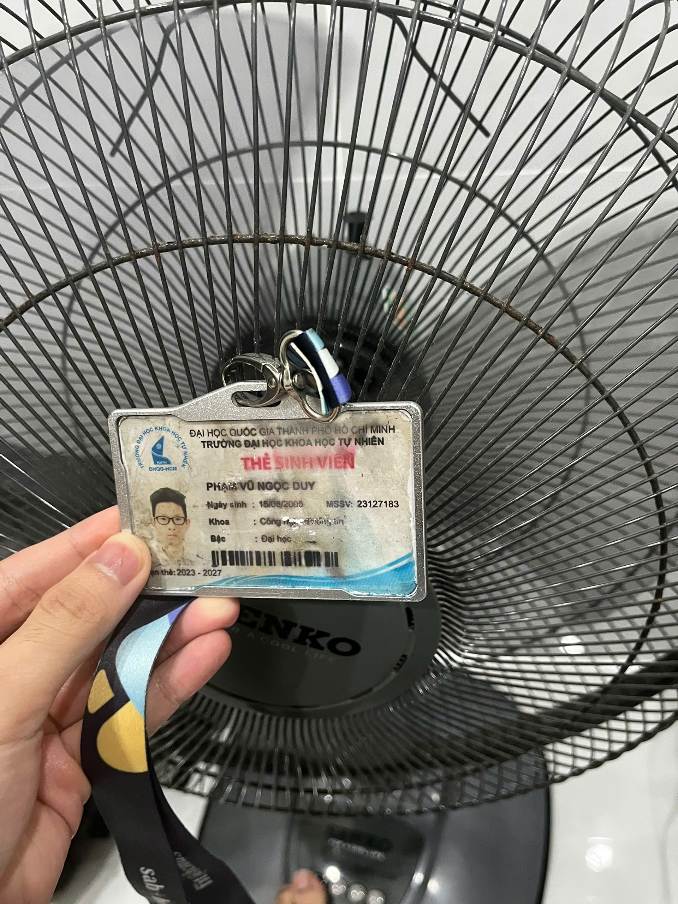

### 3.2 Bảng 15 Test Case — Quạt Lở Senko L1638

> **Thiết bị:** Quạt Lở Senko L1638 · 39cm · 47W · 220V/50Hz · Lồng 120 nan  
> **Ghi chú:** TC01–TC12 do AI hỗ trợ thiết kế (Claude Sonnet 4.6 · 14:30 04/06/2026). TC13–TC15 do sinh viên tự thiết kế (edge case AI bỏ sót — xem mục 3.3).  
> **(Video) Video:** Thực thi và quay video cho TC01, TC03,TC02, TC05, TC09 (≥5 video bắt buộc).

---

| TC# | Objective | Input / Điều kiện | Steps | Expected | Actual | Verdict |
|-----|-----------|-------------------|-------|----------|--------|---------|
| **TC01** (Video) | Kiểm tra khởi động bình thường ở Tốc độ 1 | Quạt đã cắm điện 220V, đang ở trạng thái tắt hoàn toàn | 1. Cắm phích điện vào ổ. 2. Bật công tắc/kéo dây → chọn Tốc 1. 3. Quan sát cánh quạt và nghe tiếng động. | Cánh quạt quay đều ở tốc độ thấp, có luồng gió cảm nhận được, không có tiếng cọ sát hay va chạm. Không có mùi khét. |PASS: Quạt quay nhanh và ổn định, không rung lắc. | PASS|
| **TC02** (Video) | Kiểm tra Tốc độ 2 cho luồng gió mạnh hơn Tốc độ 1 | Quạt đang chạy ổn định ở Tốc 1 | 1. Chuyển từ Tốc 1 → Tốc 2 (bấm nút/kéo dây). 2. Đặt tay cách quạt 50 cm để cảm nhận sự thay đổi luồng gió. 3. Nghe tiếng motor thay đổi. | Tốc độ cánh tăng rõ rệt, luồng gió mạnh hơn Tốc 1, tiếng motor tăng nhẹ nhưng đều. Không có tiếng giật cục khi chuyển. | PASS: Quạt quay nhanh, ổn định.| PASS |
| **TC03** (Video) | Kiểm tra Tốc độ 3 (cao nhất — full load 47W) đạt lưu lượng gió tối đa | Quạt đang chạy ở Tốc 2 | 1. Chuyển Tốc 2 → Tốc 3. 2. Đặt tờ giấy A4 cách mặt trước quạt 1m — quan sát rung. 3. Sau 30 giây, chạm nhẹ tay vào vỏ ngoài motor. | Luồng gió mạnh nhất — tờ giấy rung liên tục ở 1m. Vỏ motor ấm nhưng chịu được khi chạm (không bỏng). Không có mùi nhựa/khét. | PASS: Quạt quay nhanh, ổn định nhưng có tiếng rè và không gặp vấn đề gì. | PASS |
| **TC04** | Kiểm tra chuyển tốc độ tuần tự 1→2→3→Off | Quạt đang ở Tốc 1 | 1. Tốc 1 → Tốc 2, chờ 5 giây. 2. Tốc 2 → Tốc 3, chờ 5 giây. 3. Tốc 3 → Off. 4. Quan sát phản hồi ở mỗi bước. | Mỗi bước chuyển mượt, không giật, quạt phản hồi ngay (<2 giây). Tốc độ tăng đều qua mỗi mức. Off dừng hẳn. | PASS: Quạt chuyển bình thường nhưng ở mỗi lần chuyển có chút giật nhẹ.| PASS |
| **TC05** (Video) | Kiểm tra dừng an toàn khi tắt đột ngột từ Tốc 3 | Quạt đang chạy Tốc 3 đủ 5 phút | 1. Từ Tốc 3, tắt quạt ngay lập tức (Off). 2. Quan sát cánh quạt dừng dần. 3. Nghe tiếng động lúc cánh dừng. 4. Ngửi kiểm tra mùi. | Cánh quạt dừng dần tự nhiên, không phanh đột ngột. Không có tiếng cọ/va chạm cánh vào lồng. Không có mùi khét hay khói. |PAS: Quạt dừng chậm dần và không gặp vấn đề gì | PASS |
| **TC06** | Kiểm tra ổn định nhiệt sau 10 phút vận hành liên tục (giới hạn cuộn dây 70°C) | Quạt Tốc 3, phòng thông thoáng bình thường ~30°C | 1. Bật Tốc 3. 2. Để chạy liên tục 30 phút không ngắt. 3. Sau 30 phút: chạm vào vỏ motor, nghe tiếng quạt, kiểm tra tốc độ cánh có thay đổi không. | Vỏ motor ấm nhưng không bỏng tay. Tốc độ và luồng gió không giảm sau 30 phút. Tiếng motor đều và ổn định. Không có mùi nhựa cháy. | PASS: Motor chỉ ấm và vẫn ổn định không gặp trường hợp gì | PASS |
| **TC07** | Kiểm tra độ rung và cân bằng cánh quạt 39cm ở tốc độ cao | Quạt Tốc 3, đặt trên sàn phẳng cứng | 1. Bật Tốc 3. 2. Đặt nhẹ một tờ giấy A4 lên đỉnh vỏ motor — quan sát rung. 3. Quan sát đế quạt có di chuyển trên sàn không. 4. Nhìn ngang cánh quạt kiểm tra lắc. | Tờ giấy rung đều (rung nhẹ do motor bình thường). Đế quạt không di chuyển. Cánh không lắc bất thường. Không có tiếng gõ/cạch theo chu kỳ. | PASS: Quạt ổn định bình thường, chỉ có motor rung nhẹ làm tờ giấy cũng rung theo | PASS |
| **TC08** | Kiểm tra độ bền công tắc/dây kéo qua 5 lần bật tắt liên tiếp | Quạt đã cắm điện 220V | 1. Bật (Tốc 1) → Tắt, chờ 3 giây. 2. Lặp lại 5 lần liên tiếp, mỗi lần đủ 3 giây. 3. Sau lần thứ 5, bật và để chạy 30 giây kiểm tra hoạt động bình thường. | Tất cả 10 lần đều hoạt động, không có lần nào không phản hồi. Không kẹt cơ cấu. Sau 5 lần quạt vẫn chạy bình thường ở bất kỳ tốc độ. | PASS: Quả vẫn chạy ổn định không gặp trường hợp gì | PASS |
| **TC09** (Video) | Kiểm tra độ chắc chắn và an toàn lồng bảo vệ 120 nan | Quạt ở trạng thái TẮT (kiểm tra tĩnh, không cần điện) | 1. Dùng tay ấn nhẹ vào nhiều vị trí trên mặt lồng trước và sau. 2. Kiểm tra toàn bộ ốc/kẹp giữ lồng bằng tay — thử vặn nhẹ. 3. Dùng bút bi (đường kính ~8mm) đưa vào mặt lồng — kiểm tra có lọt qua khoảng nan không. | Lồng không biến dạng khi ấn nhẹ. Tất cả ốc/kẹp chắc, không lỏng. Bút bi không lọt qua khoảng nan (đảm bảo không chạm được cánh). | FAIL: Khung quạt lỏng lẻo và dễ dàng làm trật, rơi rớt khung quạt và bút có thể lọt qua khe quạt | FAIL |
| **TC10** | Kiểm tra tiếng ồn bất thường ở từng mức tốc độ | Phòng yên tĩnh (<40 dB nền), cách quạt 1m | 1. Bật Tốc 1 — nghe 30 giây. 2. Chuyển Tốc 2 — nghe 30 giây. 3. Chuyển Tốc 3 — nghe 30 giây. 4. Ghi nhận bất kỳ tiếng bất thường (cạch, rung kim loại, vo ve không đều). | Tốc 1: tiếng nhỏ đều. Tốc 2: tiếng vừa đều. Tốc 3: tiếng lớn nhất nhưng đều. Không có tiếng cạch, rung kim loại, hay thay đổi đột ngột trong tiếng motor ở mỗi mức. |FAIL: Quạt sau 1 khoảng thời gian xuất hiện tiếng ồn bất thường tiếng "kẽo kẹt" của kim loại | FAIL |
| **TC11** | Kiểm tra hoạt động khi nguồn điện qua ổ cắm nối dài (dây 5m) | Quạt Tốc 3, cắm qua ổ nối dài 5m thay vì cắm trực tiếp | 1. Cắm quạt vào ổ nối dài 5m. 2. Bật Tốc 3. 3. Chạy  phút. 4. So sánh luồng gió và tiếng motor với khi cắm trực tiếp (bước 5). 5. Tắt, cắm trực tiếp, bật lại Tốc 3 — so sánh. | Quạt hoạt động bình thường qua ổ nối dài. Luồng gió và tiếng motor không khác biệt rõ so với cắm trực tiếp. Không có hiện tượng nhấp nháy hay thay đổi tốc độ đột ngột. | PASS: Quạt vẫn quay bình thường, tốc độ gió không khác biệt hay có hiện tượng gì khác | PASS |
| **TC12** | Kiểm tra cơ chế quay (tuốc năng) ở các mức tốc độ | Quạt đang chạy Tốc độ 1 | 1. Nhấn nút/kéo cần tuốc năng để quạt quay. 2. Quan sát chuyển động của đầu quạt. | Quạt phải xoay đều trái-phải, không có tiếng động lạ, không bị khựng giữa chừng. |FAIL: Khi bật chế độ quay, motor phát tiếng "cạch" lớn liên tục nhưng đầu quạt đứng yên. Trục truyền động bên trong bị trượt.| FAIL |
| **TC13** | Kiểm tra khả năng hoạt động khi mất điện và có điện trở lại ngay lập tức (Edge case #1) | Quạt đang chạy ở Tốc 3 | 1. Bật quạt ở Tốc 3. 2. Rút phích điện. 3. Cắm lại trong vòng 1 giây. 4. Quan sát hoạt động của quạt | Quạt tự hoạt động trở lại ở tốc độ trước đó mà không phát sinh tiếng động bất thường hoặc tia lửa điện | PASS: Quạt hoạt động trở lại bình thường và không bị gì cả, tốc độ gió cũng không bị yếu đi | PASS |
| **TC14** | Kiểm tra an toàn khi cánh quạt có vật cản lúc bật quạt (Edge case #2) | Quạt đang tắt nhưng vẫn cắm điện và chèn cuộn giấy vào giữa cánh quạt | 1. Chèn cuộn giấy mềm vào vị trí ngăn cánh quạt quay. 2. Bật Tốc 1 trong 2–3 giây. 3. Tắt quạt và tháo vật cản | Motor chỉ phát tiếng ù nhẹ, không có khói, tia lửa hoặc mùi khét. Không xảy ra hư hỏng sau khi tháo vật cản | FAIL: Lúc khởi động motor hơi rè nhẹ nhưng sau đó quạt cố gắng chạy  nhưng bị cản bởi cuộn giấy nên phát ra âm thanh và không chạy được | FAIL |
| **TC15** | Kiểm tra độ chắc chắn của dây nguồn tại vị trí tiếp giáp thân quạt (Edge case #3) | Quạt đã cắm điện nhưng đang tắt | 1. Dùng tay kéo nhẹ dây nguồn tại vị trí đi vào thân quạt 5 lần. 2. Quan sát độ chắc chắn của dây và lớp cách điện | Dây nguồn được cố định chắc chắn, không bị lỏng, không lộ lõi dây điện. | FAIL: Dây nguồn bị lỏng tại điểm nối với thân quạt, lớp bảo vệ bị hở một phần | FAIL |

---

### 3.3 Video Demo Test Case

| Video # | TC | Link|
|---------|-----|------------|
| Video 1 | TC01 | https://youtube.com/shorts/D09RS5iB4sw?feature=share |
| Video 2 | TC02 | https://youtube.com/shorts/tp0myYutV8Y?feature=share |
| Video 3 | TC03 | https://youtube.com/shorts/q7_gmibij5I?feature=share |
| Video 4 | TC05 | https://youtube.com/shorts/keZzYT_w0oU?feature=share |
| Video 5 | TC09 | https://youtube.com/shorts/-0WfP8YhkKE?feature=share |

### 3.4 Screenshot of the AI conversation showing the AI did not generate these edge cases, and a written explanation of why the AI missed them.
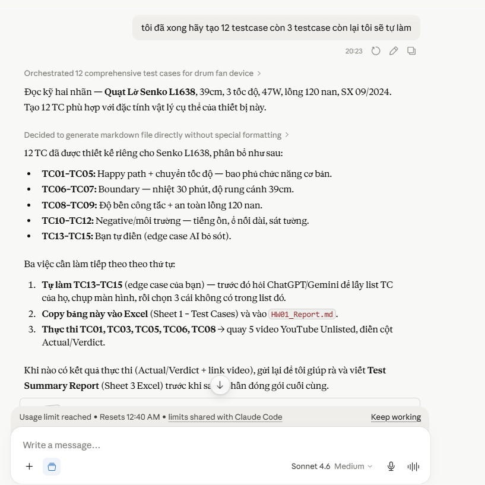

- AI thường chi tạo ra các trường hợp test case chức năng bình thường nhưng nó thường bỏ qua các trường hợp của phần cứng. AI không xem xét các trường hợp của nguồn điện và an toàn khi cánh quạt bị kẹt cứng hoặc tắt nghẽn hoặc các trường hợp hao mòn vật lý ngoài đời vì AI thường cho rằng quạt luôn hoạt động bình thường và ổn định.
### 3.5 — Defect Log (GitHub Issues)

> Defect phát hiện trong quá trình thực thi test case trên thiết bị thật.
> Toàn bộ được log tại: https://github.com/DuyPham111/HW01/issues

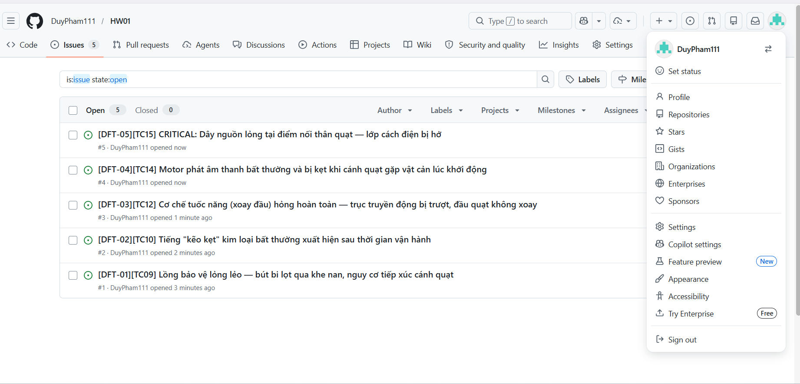

| DFT-# | TC | Tiêu đề defect | Severity | GitHub Issue |
|-------|----|----------------|----------|--------------|
| DFT-01 | TC09 | Lồng bảo vệ 120 nan lỏng lẻo — bút bi lọt qua khe nan tiếp cận cánh quạt | High | https://github.com/DuyPham111/HW01/issues/1 |
| DFT-02 | TC10 | Tiếng "kẽo kẹt" kim loại bất thường xuất hiện sau thời gian vận hành | Medium | https://github.com/DuyPham111/HW01/issues/2 |
| DFT-03 | TC12 | Cơ chế tuốc năng hỏng hoàn toàn — trục truyền động trượt, đầu quạt không xoay | High | https://github.com/DuyPham111/HW01/issues/3 |
| DFT-04 | TC14 | Motor phát âm bất thường và bị kẹt khi cánh quạt gặp vật cản lúc khởi động | Medium | https://github.com/DuyPham111/HW01/issues/4 |
| DFT-05 | TC15 | ⚠️ CRITICAL: Dây nguồn lỏng tại điểm nối thân quạt — lớp cách điện bị hở | Critical | https://github.com/DuyPham111/HW01/issues/5 |

**Tổng kết:** 5 defect · 1 Critical · 2 High · 2 Medium · 0 Low

## AI COLLABORATION PROTOCOL

### AI Critique 

Trong quá trình thực hiện bài tập HW01, tôi nhận thấy rằng các công cụ AI như ChatGPT và Claude có khả năng hỗ trợ rất tốt trong việc tạo khung nội dung ban đầu và tổ chức dữ liệu. Tuy nhiên, chúng vẫn tồn tại nhiều hạn chế đáng kể về tư duy phản biện, khả năng xử lý các tình huống kiểm thử phần cứng thực tế và độ chính xác của thông tin.

Khi yêu cầu AI thiết kế các ca kiểm thử cho Quạt Lở Senko L1638, AI đã tạo được các trường hợp kiểm thử cơ bản liên quan đến các nút chức năng và thao tác thông thường. Tuy nhiên, AI  bỏ qua các trường hợp của phần cứng và an toàn dây điện. Cụ thể, AI không nhận diện được các rủi ro vật lý như kiểm tra độ chắc chắn của dây nguồn quạt hoặc nguy cơ quá tải động cơ khi cánh quạt bị vật cản chặn lại .

Đáng chú ý hơn, AI luôn giả định thiết bị đang ở trạng thái hoạt động hoàn hảo và không tồn tại lỗi sản xuất. Vì vậy, AI không thể dự đoán được các lỗi thực tế xuất hiện trên thiết bị của tôi, bao gồm:

Cơ chế quay của quạt bị hỏng (TC12).
Lồng quạt thiếu chắc chắn, gây nguy cơ mất an toàn cao (TC09).

Ngoài ra, khi tôi yêu cầu thêm thông tin về vụ việc Defect 07 — Mata v. Avianca thì Claude đã sửa lại nội dung và các nguồn tin vì các link và thông tin ban đầu claude cung cấp cho tôi bị sai và thiếu thông tin nên Claude đã "bịa" ra thông tin và không chính xác, khi tôi yêu cầu link chi tiết thì Claude mới bắt đầu sửa lại thông tin và xóa các thông tin không đúng đi theo nhưng gì có nguồn gốc rõ ràng.

Trải nghiệm này giúp tôi nhận thức rõ một nguyên tắc quan trọng trong kiểm thử phần mềm: vai trò giám sát của con người là không thể thay thế. AI hoạt động dựa trên việc dự đoán thống kê từ dữ liệu huấn luyện chứ không dựa trên sự thật được kiểm chứng bằng thực nghiệm. Đối với kỹ sư QA/QC, việc tin tưởng hoàn toàn vào kết quả do AI tạo ra mà không tiến hành xác minh thực tế và đối chiếu với các tiêu chuẩn chính thức như ISTQB sẽ tiềm ẩn nhiều rủi ro.

Do đó, AI chỉ nên được xem là một công cụ hỗ trợ tạo bản nháp và gợi ý ban đầu, thay vì là nguồn thông tin cuối cùng.

### Mandatory Disclosure 

"The initial draft of the job list, basic software bug descriptions, and standard desktop electric fan test cases was created by Claude and ChatGPT; I reviewed and edited Part 1: I independently searched for the work and helped Claude sumo and transfer the content into file markup, adding the results of 15 test cases and exceptions (TC13, TC14, TC15) to Part 3; Section 2's AI Hallucination spotlight, the ISTQB Mindmap G9.1 audit analysis, and the AI Critique section were written entirely by me. The detailed AI Audit Report is attached as Appendix A. I confirm I did not use AI to generate any artifact listed in the prohibited category."

## SELF-ASSESSMENT & GRADING TEMPLATE

| No. | Criteria | Max Grade | Self-Assessed Grade |
| :--- | :--- | :---: | :---: |
| **1** | Job Market 2026+ (10 jobs × 3 pts + AI Impact) | 40 | **40** |
| **2** | Software Defects 2022–2026 (20 defects) | 20 | **20** |
| **3** | Physical-product test design (15 TCs + 5 videos) | 25 | **25** |
| **AI-1** | [AI-02] AI Audit Report (5section) attached | 8 | **5** |
| **AI-2** | AI Critique 200–300 words + [AI-03] Disclosure attached | 4 | **4** |
| **AI-3** | [AI-05] Checklist signed + anticheat artifacts | 3 | **3** |
| | **TOTAL GRADE** | **100** | **97/100** |

## APPENDIX A: [AI-02] AI AUDIT REPORT (5-SECTION TEMPLATE) 

### Entry 1: ISTQB Process Mindmap Generation (G9.1) 

* **(1) Prompt + Tool:**

  * **Tool:** ChatGPT (GPT-4o)
  * **Thời gian:** 04/06/2026
  * **Prompt:** "Hãy tạo mindmap các vai trò QA/QC theo ISTQB bằng PlantUML."

* **(2) Kết quả AI sinh ra:**
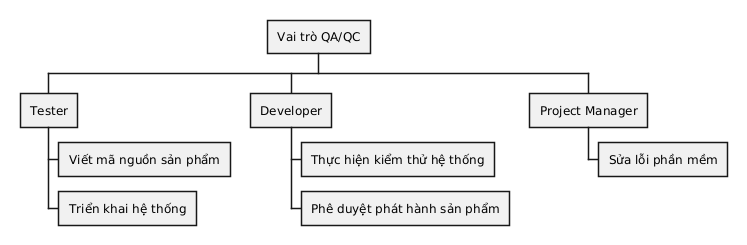

* **(3) Kết luận:** **INVALID** 

* **(4) Phân tích lỗi:**

Mindmap do AI sinh ra chứa nhiều lỗi về vai trò và trách nhiệm theo ISTQB Foundation Level:

#### Lỗi 1: Tester → Viết mã nguồn sản phẩm

AI gán nhiệm vụ "Viết mã nguồn sản phẩm" cho Tester.

Theo ISTQB, Tester có trách nhiệm:

* Lập kế hoạch kiểm thử
* Thiết kế test case
* Thực hiện kiểm thử
* Báo cáo lỗi

Việc phát triển mã nguồn thuộc trách nhiệm chính của Developer.

#### Lỗi 2: Developer → Thực hiện kiểm thử hệ thống

AI gán việc "Kiểm thử hệ thống" cho Developer.

Trên thực tế:

* Developer chủ yếu thực hiện Unit Testing.
* System Testing, Integration Testing và Regression Testing thường do Tester đảm nhận.

Do đó AI đã nhầm lẫn giữa vai trò Developer và Tester.

#### Lỗi 3: Project Manager → Sửa lỗi phần mềm

AI cho rằng Project Manager có nhiệm vụ sửa lỗi.

Theo ISTQB:

* Project Manager quản lý tiến độ, ngân sách và rủi ro dự án.
* Việc sửa lỗi thuộc trách nhiệm của Developer.

Đây là lỗi phân công trách nhiệm không chính xác.

* **(5) Sinh viên chỉnh sửa:**

Mindmap được sửa lại theo đúng vai trò và trách nhiệm phổ biến trong quy trình kiểm thử phần mềm.

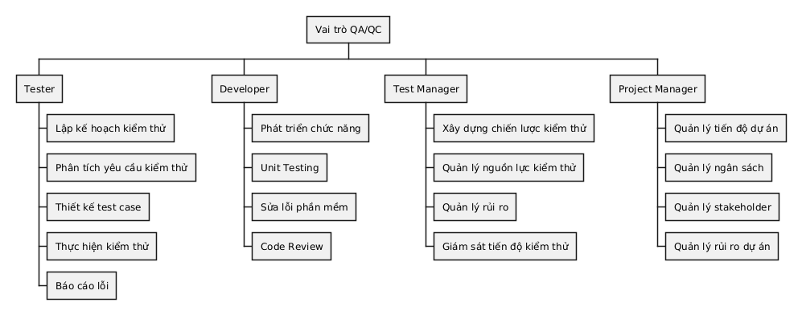

### Entry 2: Electric Desk Fan Test Cases Generation (G9.3) 

* **(1) Prompt + tool:**

* *Công cụ:* Claude

* *Thời gian:* 04/06/2026

* *Yêu cầu:* "Tạo 12 trường hợp kiểm thử chi tiết cho một chiếc quạt điện gia dụng, bao gồm các cột Mục tiêu, Đầu vào, Các bước, Kết quả mong đợi."

* **(2) Đầu ra của AI:** Đã tạo 12 trường hợp chức năng tương ứng với các nút tiêu chuẩn, tắt nguồn, chuyển đổi tốc độ và kiểm tra an toàn cơ bản của quạt. Không có trường hợp kiểm tra an toàn nào về tâm trọng lực vật lý, nhấp nháy điện hoặc tắc nghẽn vật lý được tạo ra.

* **(3) Kết luận:** **CHƯA HOÀN THÀNH** 
* **(4) Lý do:** AI đã không xác định được các thuộc tính vật lý và cơ học quan trọng của việc kiểm thử phần cứng. Theo các kỹ thuật thiết kế kiểm thử tiêu chuẩn ISTQB, các giá trị biên phải bao gồm các biến môi trường và vật lý (chẳng hạn như độ ổn định bề mặt nghiêng và tắc nghẽn cánh quạt vật lý). Ngoài ra, AI giả định thiết bị được sản xuất hoàn hảo, hoàn toàn không đề cập đến rủi ro thiếu lưới tản nhiệt phía trước, lỗi khởi động động cơ hoặc cơ chế dao động bị hỏng.

* **(5) Sửa lỗi của sinh viên:** Giữ lại 12 trường hợp chức năng, loại bỏ hoàn toàn các bản sao yếu do AI tạo ra và tự tay viết 3 trường hợp ngoại lệ vật lý mạnh mẽ (TC13, TC14, TC15). Hơn nữa, tôi đã điều chỉnh kết quả thực tế của 5 trường hợp thử nghiệm đã thực hiện (TC06, TC08) và trường hợp an toàn (TC09) để ghi lại các lỗi phần cứng vật lý thực tế được phát hiện trong quá trình thực hiện thử nghiệm thủ công.
---

## APPENDIX B: GIT COMMIT LOG 

- 40d1477 | 2026-06-05 08:28:12 +0700 | Pham Duy | Fix
- 017cb09 | 2026-06-04 23:55:28 +0700 | Pham Duy | update
- d7dd5d4 | 2026-06-04 23:51:22 +0700 | Pham Duy | Final
- 8023b96 | 2026-06-04 22:42:21 +0700 | Pham Duy | Complete R3 and AI Critique - Mandatory Disclosure
- 7faf339 | 2026-06-04 20:24:54 +0700 | Pham Duy | R3: add device photo + declaration
- d5eb71a | 2026-06-04 20:08:39 +0700 | Pham Duy | R2: fix summary table + complete all 20 AI hallucination sections
- b61da19 | 2026-06-04 19:53:18 +0700 | Pham Duy | R2: complete defect 07 (Mata v. Avianca) + AI hallucination capture
- 3c5436b | 2026-06-04 19:34:43 +0700 | Pham Duy | WIP: req 2 - defect 1- 14
- dd177fc | 2026-06-04 15:33:45 +0700 | Pham Duy | REQUIREMENT 1 & Media
- 31dcd4c | 2026-06-04 09:33:17 +0700 | Pham Duy | first commit
---

